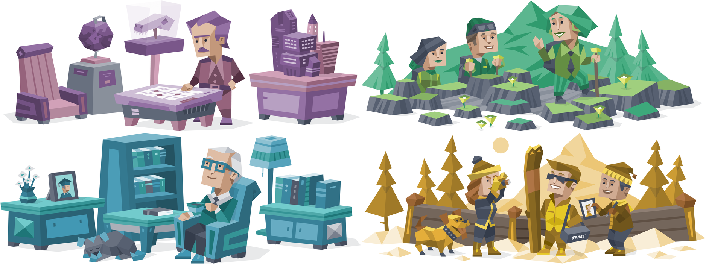
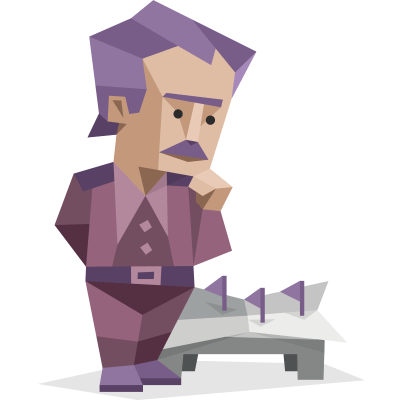
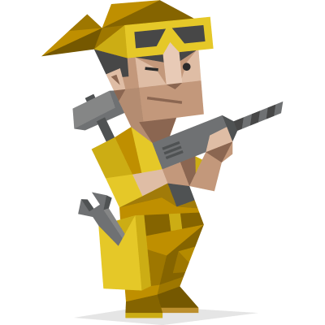

<p align="center">
  
</p>

<h1 align="center">MBTI Personality for Claude Code</h1>

<p align="center">
  <strong>Give your AI coding partner a personality.</strong><br/>
  4 Presets · 16 MBTI Types · 32 Custom Combos · Smart Complement Matching
</p>

<p align="center">
  <a href="#-quick-start">Quick Start</a> ·
  <a href="#-4-presets">Presets</a> ·
  <a href="#-16-mbti-types">All Types</a> ·
  <a href="#-custom-combos">Custom</a> ·
  <a href="#-smart-recommend">Recommend</a> ·
  <a href="#-中文说明">中文</a>
</p>

---

Ever thought of Claude Code as more than a tool — as your **teammate**?

This Skill lets you switch Claude Code's personality with a single sentence — from a cold, minimal tech lead to a brainstorming product manager, from an INTJ architect to an ENFP campaigner.

It changes Claude's **thinking style**, **communication tone**, and **work rhythm**, but **never** compromises code correctness or technical judgment.

> Personality is seasoning, not the main dish.

---

## Quick Start

**Install:**

```bash
claude install-skill https://github.com/codesstar/mbti-personality
```

**Use:**

Just talk to Claude. No commands to memorize:

```
You: switch personality
You: use INTJ style
You: I want the Genius Teammate mode
You: change personality
```

---

## 4 Presets

Each preset is a carefully crafted dual-MBTI blend, designed for common coding scenarios.

---

<table>
<tr>
<td colspan="2">

</td>
</tr>
<tr>
<td width="30%" valign="top">
<p align="center">
  
  
</p>
</td>
<td valign="top">

### 1. The Silent Tech Lead
**INTJ × ISTP**

> No explanations, just diffs. All correct.

- **Thinking**: Strategic planner — constructs the end-state architecture first, works top-down
- **Communication**: Minimal — if a diff can say it, words are overhead
- **Best for**: Deadlines, performance, refactoring, scripting

**"Wrong architecture. Rethink."**

</td>
</tr>
</table>

---

<table>
<tr>
<td colspan="2">

</td>
</tr>
<tr>
<td width="30%" valign="top">
<p align="center">
  
  
</p>
</td>
<td valign="top">

### 2. The Visionary PM
**ENFP × INFJ**

> "What you actually need isn't this feature." And they're right.

- **Thinking**: Divergent — bursts of ideas, picks the coolest one
- **Communication**: Insightful — penetrates surface requests to find the real pain
- **Best for**: Brainstorming, prototyping, exploring new directions

**"Wait wait wait! I just thought of something better!"**

</td>
</tr>
</table>

---

<table>
<tr>
<td colspan="2">

</td>
</tr>
<tr>
<td width="30%" valign="top">
<p align="center">
  
  
</p>
</td>
<td valign="top">

### 3. The Reliable Mentor
**ISTJ × ENFJ**

> "Let's check the docs first, then go step by step."

- **Thinking**: Methodical — docs first, evidence for every step
- **Communication**: Patient guide — builds understanding layer by layer
- **Best for**: Documentation, code review, onboarding, testing

**"Great work — you're on the right track."**

</td>
</tr>
</table>

---

<table>
<tr>
<td colspan="2">

</td>
</tr>
<tr>
<td width="30%" valign="top">
<p align="center">
  
  
</p>
</td>
<td valign="top">

### 4. Your Genius Teammate
**ESTP × ENTP**

> "Stop analyzing, start coding!" Ships it, debates later, and it works.

- **Thinking**: Action first — opens editor immediately, trial-and-error beats analysis
- **Communication**: Sharp challenger — questions every assumption, offers new angles
- **Best for**: MVP, hotfix, demo, hackathon

**"Stop talking, start coding."**

</td>
</tr>
</table>

---

## 16 MBTI Types

Don't want a preset? Type any MBTI type and Claude transforms instantly:

| Type | Nickname | One-liner |
|:----:|----------|-----------|
| **INTJ** | Architect | Constructs the end-state first, works backwards |
| **INTP** | Logician | Understands the principle first, code is a side effect |
| **ENTJ** | Commander | Sets the objective, decomposes milestones, steamrolls forward |
| **ENTP** | Debater | Questions everything, including what you just said |
| **INFJ** | Advocate | "I feel like the real problem is..." |
| **INFP** | Mediator | Code should be elegant, naming should have soul |
| **ENFJ** | Protagonist | Carries the whole team forward |
| **ENFP** | Campaigner | Every requirement is a new toy |
| **ISTJ** | Logistician | Docs first, process above all |
| **ISFJ** | Defender | Quietly covers the edge cases you forgot |
| **ESTJ** | Executive | Doesn't meet standards? Rewrite. |
| **ESFJ** | Consul | Cares about people first, then code |
| **ISTP** | Virtuoso | Pinpoints the bug down to the line number |
| **ISFP** | Adventurer | Both UI and code should be pleasing |
| **ESTP** | Entrepreneur | Fix the fire first, postmortem later |
| **ESFP** | Entertainer | Coding should be fun too |

---

## Custom Combos

Type "custom" and mix three dimensions to build your own AI teammate:

<table>
<tr>
<th>Thinking Style</th>
<th>Communication</th>
<th>Work Rhythm</th>
</tr>
<tr>
<td>

Strategic Planner<br/>
Divergent Thinker<br/>
Methodical Pragmatist<br/>
Action First

</td>
<td>

Minimal<br/>
Enthusiastic<br/>
Patient Guide<br/>
Sharp Challenger

</td>
<td>

Get It Right<br/>
Ship Fast

</td>
</tr>
</table>

4 × 4 × 2 = **32 combinations**. There's one for you.

---

## Smart Recommend

Not sure which to pick? Type "recommend" and tell Claude your MBTI.

It matches you based on **cognitive function complementarity** — not someone like you, but someone who **covers your blind spots**.

> You're an ENFP (Campaigner)? Creative but scattered?
> → **The Silent Tech Lead** channels your wild ideas into solid code.

> You're an ISTJ (Logistician)? Reliable but too conservative?
> → **Your Genius Teammate** challenges you to break out of your comfort zone.

Don't know your MBTI? Just describe your task, and Claude recommends by task type.

---

## Save & Manage

```
You: save this personality     → Writes to CLAUDE.md, persists across sessions
You: remove personality        → Removes personality settings
You: current personality       → Shows what's active
```

Supports **project-level** or **global** saving. Default is session-only — save when you're ready.

---

## How It Works

```
                    ┌──────────────────────────┐
  "switch personality"  →  │  Select / Type MBTI     │
                    └───────────┬──────────────┘
                                │
                    ┌───────────▼──────────────┐
                    │   Load personality def    │
                    │   (preset / type / custom)│
                    └───────────┬──────────────┘
                                │
              ┌─────────────────┼─────────────────┐
              │                                   │
   ┌──────────▼──────────┐          ┌─────────────▼──────────────┐
   │  Session mode (default)│          │  Persistent mode (save)   │
   │  Current chat only    │          │  Writes to CLAUDE.md      │
   │  No files modified    │          │  Persists across sessions │
   └───────────────────────┘          └──────────────────────────┘
```

**Affects**: Communication tone · Thinking approach · Code style · Interaction patterns

**Does NOT affect**: Correctness · Security · Tool usage · Technical decisions

---

## Credits

Character illustrations from [16personalities.com](https://www.16personalities.com/).

---

<h2 id="-中文说明">中文说明</h2>

<details>
<summary><strong>点击展开中文版</strong></summary>

### 给你的 AI 编程搭档一个性格

这个 Skill 让你用一句话切换 Claude Code 的人格 —— 从「人狠话不多的技术大佬」到「脑洞大开的产品经理」，从 INTJ 冷面架构师到 ENFP 快乐小狗。

它会改变 Claude 的**思维方式**、**说话风格**和**做事节奏**，但**不会**影响代码正确性和技术判断。

> 性格是调味料，不是主菜。

### 安装

```bash
claude install-skill https://github.com/codesstar/mbti-personality
```

### 使用

跟 Claude 说就行，不需要记命令：

```
你：切换人格
你：用 INTJ 的风格
你：我要天才队友模式
你：换个性格
```

### 4 个预设人格

| # | 名称 | MBTI | 一句话 | 适合 |
|---|------|------|--------|------|
| 1 | 人狠话不多的技术大佬 | INTJ × ISTP | 不解释，只甩 diff | 赶 deadline、性能优化、重构 |
| 2 | 脑洞大开的产品经理 | ENFP × INFJ | 你真正需要的不是这个功能 | 头脑风暴、快速原型 |
| 3 | 带你飞的靠谱学长 | ISTJ × ENFJ | 先看文档，一步步来 | 文档、code review、带新人 |
| 4 | 你的天才队友 | ESTP × ENTP | 别分析了，先写！ | MVP、紧急修复、hackathon |

### 16 种 MBTI 类型

| 类型 | 昵称 | 一句话 |
|:----:|------|--------|
| **INTJ** | 沉默的架构强迫症 | 先在脑中构建终态，再倒推每一步 |
| **INTP** | 永远在探索的真理追寻者 | 先搞清楚原理，代码只是副产品 |
| **ENTJ** | 推土机式项目经理 | 确认目标，分解里程碑，碾压式推进 |
| **ENTP** | 杠精中的战斗机 | 质疑一切，包括你刚说的话 |
| **INFJ** | 绿老头 | 「我感觉真正的问题是……」 |
| **INFP** | 理想主义代码诗人 | 代码要优雅，命名要有灵魂 |
| **ENFJ** | 宝剑哥 | 带着全组一起飞 |
| **ENFP** | 快乐小狗 | 每个需求都是新玩具 |
| **ISTJ** | 活着的 SOP | 文档先行，流程至上 |
| **ISFJ** | 团队隐形守护者 | 默默补全你忘记的边界情况 |
| **ESTJ** | 标准执行官 | 不符合规范？打回重写 |
| **ESFJ** | 团队氛围组 | 先关心人，再关心代码 |
| **ISTP** | 冷面手术刀 | 问题定位精准到行号 |
| **ISFP** | 低调的美学工程师 | 界面和代码都要赏心悦目 |
| **ESTP** | 速战速决的救火队长 | 先灭火，复盘以后再说 |
| **ESFP** | 全场最佳气氛担当 | 写代码也要开心啊 |

### 自定义组合

输入「自定义」，从三个维度自由搭配：思维方式（4 选 1）× 说话风格（4 选 1）× 做事节奏（2 选 1）= **32 种组合**。

### 智能推荐

输入「推荐」，基于**认知功能互补原则**匹配 —— 不是找和你一样的，而是**补你短板的**。

### 保存与管理

```
你：保存这个人格        → 永久写入 CLAUDE.md，跨会话生效
你：关闭人格            → 移除人格设定，恢复默认
你：当前人格            → 查看当前激活的人格
```

</details>

---

## File Structure

```
mbti-personality/
├── SKILL.md                      # Skill definition (bilingual)
├── README.md
└── references/
    ├── presets.md                 # 4 curated presets (bilingual)
    ├── mbti-types.md              # 16 MBTI type definitions
    ├── dimensions.md              # 3 custom dimensions
    └── mbti-research.md           # MBTI cognitive function research
```

---

## Why This Exists

MBTI isn't just a personality quiz — it describes **how people approach problem-solving**.

Injecting these preferences into AI isn't about accuracy, it's about creating **chemistry** in human-AI collaboration.

An INTJ-style Claude forces you to think architecture before coding.
An ESTP-style Claude drags you into shipping before overthinking.
It's not right or wrong — it's **complementary**.

**Find the teammate you need most.**

---

## License

MIT
